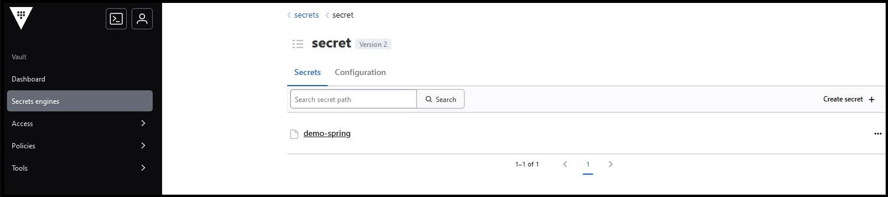
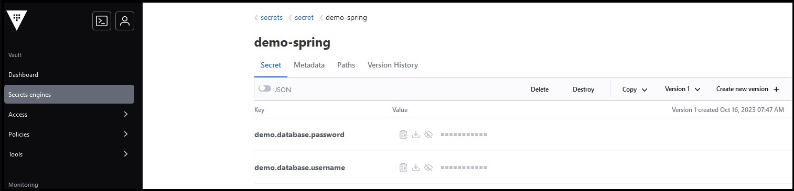
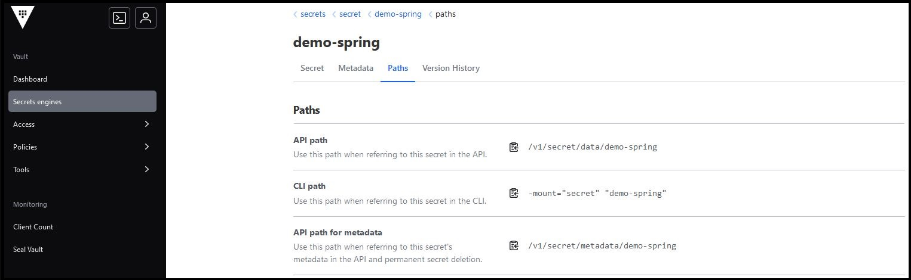
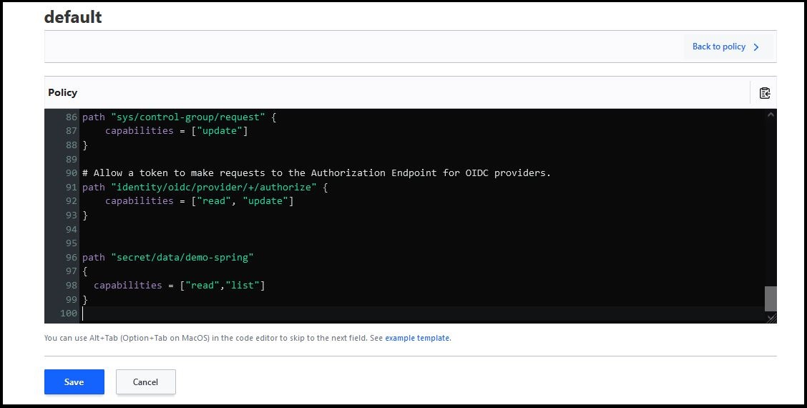

# Overview
This is a simple web application to showcase the usage of Hashicorp Vault
to manage sensitive spring-boot application properties.

<p align="center" style="padding:10px;background-color: white;">
  <reportTable style="width: 80%;">
    <tr>
    <td></td>
    <td>&nbsp;&nbsp;&nbsp;&nbsp;&nbsp;&nbsp;&nbsp;&nbsp;&nbsp;&nbsp;&nbsp;&nbsp;&nbsp;</td>
    <td></td>
    </tr>
  </reportTable>
</p>

### Deployment & Testing

- Run this [docker-compose](./src/main/valult-local/docker-compose.yml) file to init the vault.
- By default, vault will run on Development mode for testing; Open management
  page [here](http://localhost:8200/ui/vault/dashboard).
- Get the root token from your container log and use it to access vault page.
- Then, you can open `Access > Authentication Methods`, then add `userpass` access method.
- On this tutorial, create a User within `userpass` with username `ali` and password `Pass@1234`.
- Go to `Access > Entities` and assign default policy to the entity/user you just created.
  > If entity didn't show up, then you need to logout >> login with user credentials >> logout >> login with root.
- Later you can create your secrets on `Secret Engines`, then add two entries for username & password as shown below:

  <table>
    <tr><td></td></tr>
    <tr><td></td></tr>
    <tr><td></td></tr>
  </table>

- For this example, add below values to `spring-demo`:

  | `demo.database.username` | test      |
  |--------------------------|-----------|
  | `demo.database.password` | Test@1234 |

  > Make sure to copy the api path.

- Then you can call the api with your user credentials and get a token
  ```shell 
    curl --location 'http://localhost:8200/v1/auth/userpass/login/ali' --header 'Content-Type: application/x-www-form-urlencoded' --data-urlencode 'password=Pass@1234'
  ```
- Pass the obtained **client_token** to the application via `${VAULT_TOKEN}` env variable.

- Next, update your **default policy** from `Policies > ACL Policies` like shown below:
  <br/>
  <table>
    <tr><td></td></tr>
  </table>

  > This is to allow this user to read those secrets — To read more about [policies](https://developer.hashicorp.com/vault/docs/concepts/policies).

- Run your application.
- Access the H2 database [console]("http://localhost:9090/h2-console/") to verify the credentials are loaded and working
  properly.